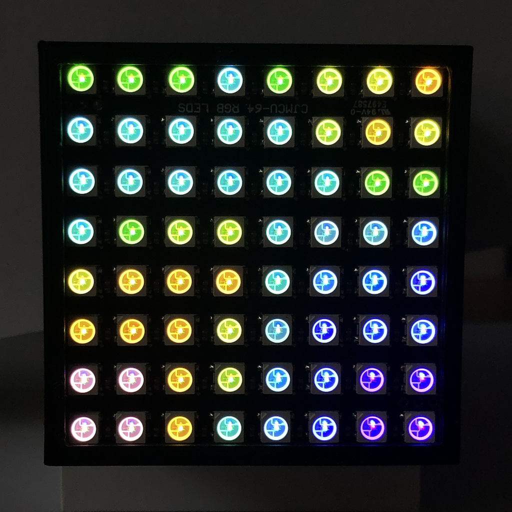
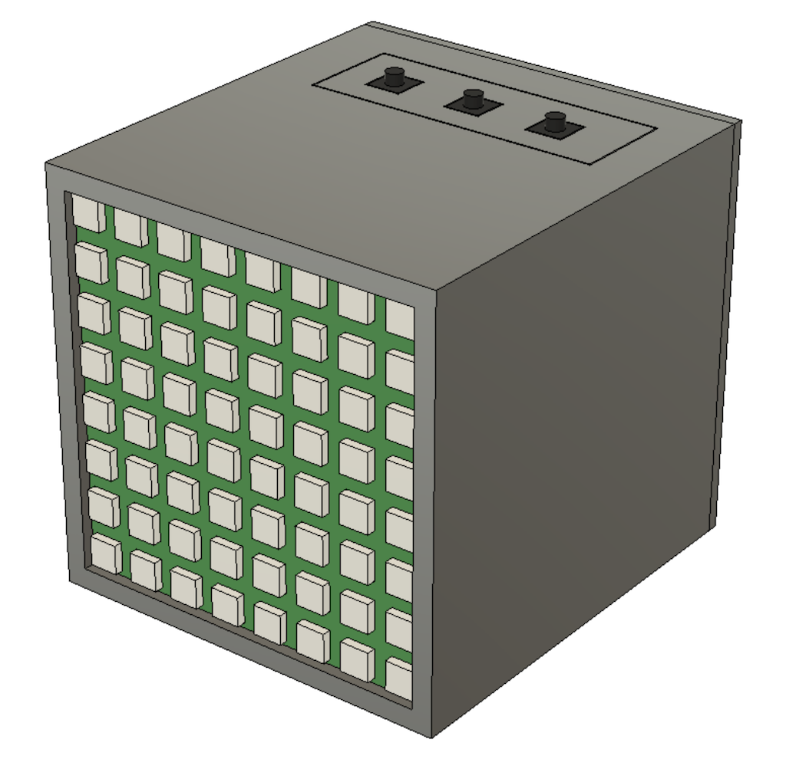

## Reaction-Diffusion Simulation using the Gray Scott Model

A simulation of two chemicals diffusing over time running on an Arduino with an LED matrix as display in a nice little box.

### Reaction-Diffusion

From [Reaction-Diffusion Tutorial](https://www.karlsims.com/rd.html) by Karl Sims

> A simulation of two virtual chemicals reacting and diffusing on a 2D grid using the Gray-Scott model:
> - Chemical A is added at a given "feed" rate.
> - Chemical B is removed at given "kill" rate.
> - Reaction: Two Bs convert an A into B, as if B reproduces using A as food.
> - Diffusion: Both chemicals diffuse so uneven concentrations spread out across the grid, but A diffuses faster than B.

**See also:**

- https://github.com/keichi/gray-scott
- https://github.com/SebLague/Reaction-Diffusion

### Requirements

- [Arduino Uno R3](https://store.arduino.cc/products/arduino-uno-rev3)
- [FastLED](http://fastled.io) compatible 8x8 LED matrix
- 3 push buttons

### Setup

- Connect LED Matrix to pin 3 (to change see `LED_PIN` macros in file `display.h:8`)
- Connect buttons to pins (to change see `*_PIN` macros in file `menu.h:6`)
    - `PREV` (down): 10
    - `NEXT` (up): 11
    - `ENTER` (select): 12
- Compile & upload `GrayScott.ino` to Arduino using [Arduino IDE](https://www.arduino.cc/en/software) or [Visual Studio Code](https://code.visualstudio.com)

**Optional:**

- 3D print the enclosure contained in files
  - `Enclosure.f3d` (for Autodesk Fusion 360) or
  - `Enclosure.step`
- Mount LED Matrix, Arduino and buttons into enclosure

### Usage

The simulation starts automatically from a random grid configuration. Long press `ENTER` to reset/restart the simulation.

Press the `ENTER` button during simulation to get to the menu. The menu allows changing the simulation parameters. Press the `PREV` and `NEXT` buttons to cycle between parameters

- A: diffusion rate
- A+: feed rate
- B: diffusion rate
- B-: kill rate
- X: close menu

There are two extra simulation parameters not present in the standard Gray-Scott model: drip rate A and B. Both are fixed for now. The drip rate defines the rate at which chemicals A and B "drip" into the grid, just to make it a bit more fun :)

Press `ENTER` to get to the selected parameter's value. A parameter value is shown as a gradually filled LED matrix. Use `PREV` and `NEXT` to decrease and increase the value. Pressing `ENTER` again sets the value and returns to the menu. Pressing `ENTER` on `X` closes the menu All simulation parameters are saved to EEPROM on menu close.

The default simulation parameters are
- Chemical A
  - Diffusion rate: `1.0`
  - Feed rate: `0.055`
  - Drip rate: `0.05`
- Chemical B
  - Diffusion rate: `0.5`
  - Feed rate: `0.062`
  - Drip rate: `0.01`

### License

The MIT License (MIT)

Copyright (c) 2021-2022 Tim Gleue

Permission is hereby granted, free of charge, to any person obtaining a copy
of this software and associated documentation files (the “Software”), to deal
in the Software without restriction, including without limitation the rights
to use, copy, modify, merge, publish, distribute, sublicense, and/or sell
copies of the Software, and to permit persons to whom the Software is
furnished to do so, subject to the following conditions:

The above copyright notice and this permission notice shall be included in all
copies or substantial portions of the Software.

THE SOFTWARE IS PROVIDED “AS IS”, WITHOUT WARRANTY OF ANY KIND, EXPRESS OR
IMPLIED, INCLUDING BUT NOT LIMITED TO THE WARRANTIES OF MERCHANTABILITY,
FITNESS FOR A PARTICULAR PURPOSE AND NONINFRINGEMENT. IN NO EVENT SHALL THE
AUTHORS OR COPYRIGHT HOLDERS BE LIABLE FOR ANY CLAIM, DAMAGES OR OTHER
LIABILITY, WHETHER IN AN ACTION OF CONTRACT, TORT OR OTHERWISE, ARISING FROM,
OUT OF OR IN CONNECTION WITH THE SOFTWARE OR THE USE OR OTHER DEALINGS IN THE
SOFTWARE.
